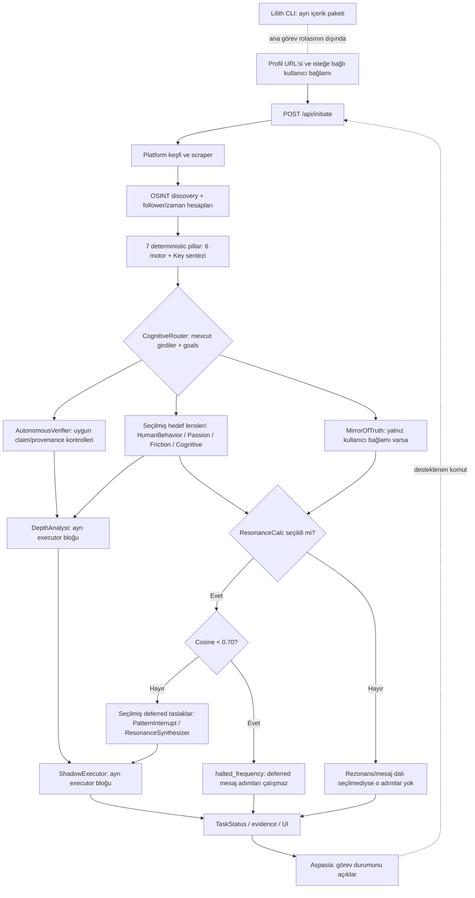

# PINEAL EPİFİZ v5.1 · PINEAL-HERETIC

> **"Kodu okuyanla belgeyi okuyan aynı şeyi görecek."**  
> Bu belge, depodaki canlı koddan iğneden ipliğe doğrulanmış teknik, mimari ve operasyonel kılavuzdur.  
> **Doğrulama Noktası:** HEAD `f8a50d14` (2026-09-23).  
> Bu sürümde yalnızca **kodda birebir karşılığı olan** bileşenler, ajanlar, algoritmalar ve arayüzler anlatılır; hayali iddia, sahte simülasyon veya uydurma rota yer almaz.

---

# PINEAL — İnsan Dilinde

Pineal, sağlanan sosyal profil örneğinden **kaynak alanlarını**, bu alanlardan kodla türetilen **betimleyici hesaplamaları** ve LLM'lerin ürettiği **yorumları** ayrı ayrı sunmayı amaçlayan bir analiz prototipidir. Erişim, veri kapsamı ve sonuçlar scraper'a, görevin girdilerine ve etkin sağlayıcılara bağlıdır; her görevde her adım çalışmaz.

> **Sınır:** Bu bir psikolojik test, klinik değerlendirme, kimlik doğrulama veya iki kişi arasında gerçek uyum ölçümü değildir. Bir gönderinin, alanın ya da zaman aralığının bulunmaması, kişinin hayatında gizli bir olay veya sorun olduğunu kanıtlamaz.

## 1. Bu sistem gerçekte ne yapıyor?

- Bir profil bağlantısından erişilebilen alanları toplar. Varsayılan ürün akışı Instagram içindir; Instagram scraper'ı en fazla 12 postu profil örneğine alır. Erişilemeyen veya yetersiz verili alanlar her zaman doldurulmaz.
- Gönderi metni ve zaman damgalarından bazı tekrar üretilebilir betimleyici hesaplamalar yapar. Bunlar yalnızca sağlanan örneklemi tarif eder; kişinin psikolojisini veya yaşamındaki nedenleri ölçmez.
- Girdi ve rota elverdiğinde ajanlara profil metni, görsel özet, zaman/etkileşim sayıları ya da kullanıcının kendi verdiği bağlam üzerinde görev verir.
- Bazı biyografi iddialarını arama sağlayıcısı yapılandırılmışsa kaynaklarla kontrol etmeye çalışır. Bu kontrol bütün profilin doğru olduğunu kanıtlamaz.
- Görev durumunu, ajan çıktılarını ve uygun olduğunda **gönderilmeyen** ilk iletişim taslaklarını arayüzde gösterir.

## 2. Koddaki ajanların altı soruluk anatomisi

`PinealExecutor` kayıt defterinde **13 görev ajanı** vardır. Her birinin her görevde çalıştığı anlamına gelmez: router, hedef/kullanıcı girdisine ve amaçlara göre seçim yapar; bazı adımlar ayrı executor bloklarında çağrılır. `InterpreterAgent` isteğe bağlıdır. Aspasia, DialogueManager ve Lilith ise kayıt defterindeki 13 ajanla aynı türde/aynı akışta değildir; aşağıda ayrıca belirtilir.

### Sonuç etiketleri

- **[KAYNAK / GÖZLEM]** Scraper'ın veya belirli bir sağlayıcının gerçekten döndürdüğü alan. Kaynağın varlığı, içeriğin bağımsız doğrulandığı anlamına gelmez.
- **[KOD HESAPLAMASI]** Aynı girdide tekrarlanabilen aritmetik/heuristik çıktı. Deterministik olması, psikometrik geçerlilik veya doğruluk kalibrasyonu sağlamaz.
- **[MODEL ÇIKARIMI]** LLM'nin ürettiği sınıflama, skor, özet veya metin. Şema sayısal bir alanı sınırlasa da sayıyı gerçek dünyada kalibre etmez.
- **[HARİCİ İDDİA KONTROLÜ]** Belirli bir iddianın arama kaynağıyla karşılaştırılması. Claim-level `DOĞRULANDI`, `YALAN` (doğrudan refütasyon adayı), `ÇELİŞKİLİ` ve `BİLİNMİYOR` ayrı durumlardır; iç provenance uyuşmazlığı olgusal refütasyon değildir. `YALAN` ancak aynı claim'e bağlı, kaynaklı doğrudan refütasyon koşulları sağlanırsa downstream veto adayı olabilir. Otonom doğrulayıcı bir doğruluk oracle'ı değildir.

### Kayıtlı 13 görev ajanı

#### `mirror_truth` — [KOD HESAPLAMASI + MODEL ÇIKARIMI]
1. **Sen kimsin?** Kullanıcının kendi beyanını yansıtan görev ajanısın; hedef profili incelemezsin.
2. **Neye bakıyorsun?** Kullanıcının isteğe bağlı ritüel, çalma listesi ve arzu alanlarına.
3. **Ne arıyorsun?** Metindeki sözcük sıklığını ve anchor'ları hesaplar; ayrıca LLM'den yüzey persona/alignment yorumu ister.
4. **Ne bulabiliyorsun?** `MirrorReflection`: sözcük/frekans özeti ve model yorumu. Bu, ölçülmüş bir kişilik sonucu değildir.
5. **Çıktını kime veriyorsun?** Executor'daki `user_mirror` alanına ve oradan kullanıcı vektörü, rezonans ve bazı mesaj/gölge adımlarına.
6. **Bir kullanıcı seni ne zaman kullanır?** Ana görevde kendi bağlam alanlarını doldurursa seçilirsin; alanlar boşsa router seni seçmez.

#### `human_behavior` — [KOD HESAPLAMASI + MODEL ÇIKARIMI]
1. **Sen kimsin?** Sınırlı profil örneğinden görünür metin/zaman sinyalleri ve bunlara ilişkin yorum üreten ajansın.
2. **Neye bakıyorsun?** Bio, post metinleri, paylaşım zamanları ve desteklenen uzak görsel URL'lerine. Ana görev akışında görseller yerel geçici dosyalara indirilebildiğinden HumanBehavior'ın kendi uzak-URL görsel alt adımı bu dosyaları kullanmayabilir; `VisionAnalyzer` ayrı bir görsel özeti üretir.
3. **Ne arıyorsun?** Kodla çıkarılan dil/zaman sinyallerini ve LLM'nin olası/alternatif yorumlarını.
4. **Ne bulabiliyorsun?** `DigitalColdReading`; `achilles_score` pozitif LLM değerinden veya kodun çelişki hesabından gelebilir. Skor klinik ya da kalibre edilmiş psikolojik ölçüm değildir.
5. **Çıktını kime veriyorsun?** Executor'ın hedef analizine, hedef vektörüne ve bazı sonraki kanıt/mesaj adımlarına.
6. **Bir kullanıcı seni ne zaman kullanır?** Hedef verisi varsa ve router ilgili hedef analizini seçerse çalışırsın.

#### `passion_mapper` — [MODEL ÇIKARIMI]
1. **Sen kimsin?** Hedefin paylaşımlarını ilgi/tutku alanları açısından özetleyen profil lensisin.
2. **Neye bakıyorsun?** Bio'ya, ilk gönderi metinlerine, varsa görsel özetine ve sınırlandırılmış upstream girdiye.
3. **Ne arıyorsun?** Metinde/görsel özetinde dayanağı olduğu ileri sürülen konuları, enerji alanlarını ve alıntıları.
4. **Ne bulabiliyorsun?** LLM üretimi `PassionProfile`; bağımsız kişilik ölçümü değildir.
5. **Çıktını kime veriyorsun?** HolisticProfile'a, uygun olduğunda rezonans/sentez adımlarına ve görev görünümüne.
6. **Bir kullanıcı seni ne zaman kullanır?** Hedef verisi ve router'da uygun amaç bulunduğunda.

#### `friction_detector` — [MODEL ÇIKARIMI + KOD FALLBACK'İ]
1. **Sen kimsin?** Olası hassasiyet ve sınır işaretleri isteyen profil lensisin.
2. **Neye bakıyorsun?** Hedef bio'suna, gönderilerine, varsa görsel özetine ve sınırlı upstream girdiye.
3. **Ne arıyorsun?** LLM'den olası sensitivities, stress triggers ve boundary signals ister.
4. **Ne bulabiliyorsun?** `FrictionProfile`; gözlenmiş kişisel sınır olarak kabul edilemez. LLM alanları boş kaldığında kod bazı genel sınır ifadelerini fallback olarak ekleyebilir.
5. **Çıktını kime veriyorsun?** HolisticProfile'a ve uygun rezonans/sentez tüketicilerine.
6. **Bir kullanıcı seni ne zaman kullanır?** Hedef girdisi ve uygun route amacı varsa otomatik seçilirsin.

#### `cognitive_profiler` — [MODEL ÇIKARIMI]
1. **Sen kimsin?** Profildeki görünür iletişim üslubunu kategorilere ayıran profil lensi ajansın.
2. **Neye bakıyorsun?** Bio'ya, gönderi metinlerine ve varsa görsel özetin estetik alanına.
3. **Ne arıyorsun?** İletişim tonu, karmaşıklık ve benzeri üslup alanları.
4. **Ne bulabiliyorsun?** `CognitiveStyle`; kalıcı bilişsel nitelik veya tanı değildir.
5. **Çıktını kime veriyorsun?** HolisticProfile'a, uygun rezonans/sentez adımlarına ve görev görünümüne.
6. **Bir kullanıcı seni ne zaman kullanır?** Hedef verisi ve uygun route amacı olduğunda.

#### `authenticity_auditor` — [MODEL ÇIKARIMI]
1. **Sen kimsin?** Metin ile görsel özet arasında olası tutarlılık farkları arayan ajansın.
2. **Neye bakıyorsun?** Bio/gönderi metinlerine ve `VisionAnalyzer` tarafından üretilmiş görsel özete.
3. **Ne arıyorsun?** Metinsel beyanın görsel özette desteklenip desteklenmediğini.
4. **Ne bulabiliyorsun?** `authenticity_score`, desteklenen iddia ve olası boşluklar; bunlar LLM yorumudur, gerçek kimliği doğrulamaz ve fotoğrafın çalıntı olup olmadığını saptamaz.
5. **Çıktını kime veriyorsun?** Görev kayıtlarına ve arayüzün ajan ayrıntılarına.
6. **Bir kullanıcı seni ne zaman kullanır?** Hedef verisiyle birlikte kullanılabilir `visual_evidence` varsa router seçer.

#### `autonomous_verifier` — [HARİCİ İDDİA KONTROLÜ + İÇ KANIT BÜTÜNLÜĞÜ]
1. **Sen kimsin?** Harici iddia kontrolü ile iç provenance kontrolünü birbirinden ayıran doğrulama ajanısın; doğruluk oracle'ı değilsin.
2. **Neye bakıyorsun?** Uygun bio iddialarına ve arama sağlayıcısı sonuçlarına; ayrıca görevdeki canonical observation/provenance alanlarına.
3. **Ne arıyorsun?** İddia ile kaynak alıntının uyumunu veya canonical kaydın bütünlüğünü.
4. **Ne bulabiliyorsun?** `DOĞRULANDI`, `YALAN`, `ÇELİŞKİLİ` ya da `BİLİNMİYOR` durumları ve ayrı bütünlük kontrolleri. `BİLİNMİYOR` yanlış demek değildir; iç bütünlük uyuşmazlığı da olgusal çürütme değildir.
5. **Çıktını kime veriyorsun?** Claim gate'e, ilgili downstream kararlara, DepthAnalyst'a ve görev ayrıntılarına.
6. **Bir kullanıcı seni ne zaman kullanır?** Hedef verisi olan görevlerde router tarafından seçilirsin; web kontrolü ancak claim ve sağlayıcı koşulları varsa sonuç verir.

#### `osint_investigator` — [HARİCİ KAYNAK ARAMASI]
1. **Sen kimsin?** Router dışındaki discovery aşamasında çalışan kullanıcı-adı odaklı OSINT ajanısın.
2. **Neye bakıyorsun?** Hedef username/name alanlarına ve yapılandırılmış OSINT sağlayıcılarına.
3. **Ne arıyorsun?** Sağlayıcıda gerçekten dönen platform eşleşmelerini ve varsa kayıt alanlarını.
4. **Ne bulabiliyorsun?** Sağlayıcıya bağlı bir `OsintProfile`; eşleşme kimlik doğrulaması değildir. Sağlayıcı/anahtar yoksa sonuç sınırlı veya unavailable olabilir.
5. **Çıktını kime veriyorsun?** Görev durumuna, `public_osint` girdisine, uygun downstream raporlara ve UI'ye.
6. **Bir kullanıcı seni ne zaman kullanır?** Hedef adı/kullanıcı adı varsa executor discovery aşamasında çağırır; router planında yer almazsın.

#### `resonance_calc` — [KOD HESAPLAMASI; GİRDİLERİN BİR KISMI MODEL TAHMİNİ]
1. **Sen kimsin?** İki taraf için sağlanan vektörleri ve metin öğelerini hesapla karşılaştıran ajansın.
2. **Neye bakıyorsun?** Kullanıcı/hedef vektörlerine ve tutku, sınır, üslup, kullanıcı beyanı alanlarına.
3. **Ne arıyorsun?** Cosine benzerliği, sözcüksel örtüşme ve çelişen alanları.
4. **Ne bulabiliyorsun?** `ResonanceProfile`; cosine hesaplaması deterministiktir, ancak vektörler model tahminidir. Skor gerçek ilişki uyumunu ölçmez.
5. **Çıktını kime veriyorsun?** Görev durumuna ve karar hattına. Seçildiğinde skor `< 0.70` ise executor görevi mesaj adımlarından önce durdurur.
6. **Bir kullanıcı seni ne zaman kullanır?** Hedef ve kullanıcı girdileri bulunduğunda ve router bu yeteneği seçtiğinde.

#### `pattern_interrupt` — [MODEL ÇIKARIMI / TASLAK]
1. **Sen kimsin?** Kaynağa bağlı, saygılı ilk iletişim taslağı hazırlayan ajansın; gönderim aracı değilsin.
2. **Neye bakıyorsun?** Normal rotada hedef analizi ve kullanıcı aynasına; canonical mod etkinse adapter'ın seçtiği dar gözlem bağlamına.
3. **Ne arıyorsun?** Yeterli dayanak varsa tek bir açılış cümlesi ve devam senaryoları.
4. **Ne bulabiliyorsun?** `GeneratedMessage`; metin LLM üretimidir, hedefin tepkisini veya mesajın kalitesini doğrulamaz.
5. **Çıktını kime veriyorsun?** Görev kaydına ve UI'de gösterilen taslağa; platforma otomatik göndermez.
6. **Bir kullanıcı seni ne zaman kullanır?** Hedef ve kullanıcı verisiyle router seçerse, gerekli girdiler mevcutsa ve rezonans eşiği görevi durdurmamışsa.

#### `resonance_synthesizer` — [MODEL ÇIKARIMI / TASLAK]
1. **Sen kimsin?** Kullanıcının kendi bağlamı ile hedef profil lenslerini sentezleyen ajansın.
2. **Neye bakıyorsun?** Kullanıcı beyanına ve hedefin passion/friction/cognitive çıktısına.
3. **Ne arıyorsun?** Ortak konu veya olası bir iletişim açılışı.
4. **Ne bulabiliyorsun?** `AuthenticBridge`; LLM önerisidir, ölçülmüş uyum veya gönderilmiş mesaj değildir.
5. **Çıktını kime veriyorsun?** HolisticProfile'a, görev kanıt/çıktı kayıtlarına ve UI'ye.
6. **Bir kullanıcı seni ne zaman kullanır?** İki taraf için gerekli veri varsa ve router seçmişse; önceki rezonans kapısı akışı durdurmamış olmalı.

#### `depth_analyst` — [MODEL ÇIKARIMI + ALINTI FİLTRESİ]
1. **Sen kimsin?** Profil örneği ve hazırlanan rapor girdilerinden LLM özeti oluşturan ajansın; deterministik depth motoru değilsin.
2. **Neye bakıyorsun?** Profil metni, görsel özet, zaman/follower raporları, OSINT, psychodynamic-depth çıktısı ve yapılandırılmış verifier sonuçlarına.
3. **Ne arıyorsun?** Alıntıyla desteklenebilir rapor bulguları, çelişki ve zaman özeti.
4. **Ne bulabiliyorsun?** `DepthReport` içindeki `reality_index`, bulgular ve tek cümlelik özet LLM çıktılarıdır; QuoteGuard alıntı biçimini filtreler, raporu doğruluk ölçüsüne çevirmez.
5. **Çıktını kime veriyorsun?** `TaskStatus`, görev kayıtları ve UI rapor kartlarına.
6. **Bir kullanıcı seni ne zaman kullanır?** Ana executor akışının ayrı derinlik adımında çağrılırsın; CognitiveRouter listesinde değilsin.

#### `shadow_executor` — [HEURISTIC + MODEL ÇIKARIMI]
1. **Sen kimsin?** Executor'ın özel blokta çalıştırdığı Shadow katmanısın; normal router seçeneği değilsin.
2. **Neye bakıyorsun?** Hedef girdisine, psychodynamic-depth çıktısına, kullanıcı aynasına ve varsa PatternInterrupt taslağına.
3. **Ne arıyorsun?** Kod eşiklerinden türetilen strateji etiketi, metin tema kümesi ve mesaj bileşimi.
4. **Ne bulabiliyorsun?** `ShadowResult`; gerçek bir Dark Triad trait puanlaması şu an yoktur, o alanlar metinden otomatik skorlanmaz. Strateji ve mesajı kanıtlanmış psikolojik bulgu gibi okumayın.
5. **Çıktını kime veriyorsun?** Shadow görev kayıtlarına ve sınırlı UI alanlarına; ayrıca iki ayrı deneysel API rotası vardır.
6. **Bir kullanıcı seni ne zaman kullanır?** Hedef girdisi varsa ana görev sonunda özel blok çalıştırabilir; ayrıca `/api/experimental/shadow/analyze` veya `/api/experimental/shadow/generate` açıkça çağrılabilir. Bunlar standart UI seçeneği değildir.

### Kayıt defteri dışındaki gerçek yüzeyler

#### `AspasiaChief` — [MODEL ÇIKARIMI; DURUM GİRDİLERİ KAYNAKLI]
1. **Sen kimsin?** UI'de kullanıcıyla konuşan görev ve sistem durumu asistanısın; 13 görev ajanından biri değilsin.
2. **Neye bakıyorsun?** Kullanıcının sorusuna, görev telemetrisine, kanıt/verdict özetine ve salt-okunur denetim özetine. Kullanıcının kişiliğini analiz konusu yapmazsın.
3. **Ne arıyorsun?** Durum açıklaması veya komut kanalında sınırlı bir intent: boş/no-action, `explain_status` ya da desteklenen açık Instagram URL'siyle analiz başlatma.
4. **Ne bulabiliyorsun?** Sohbet yanıtı veya komut kabul/red ve task ID. Başarılı chat yanıtındaki `confidence_assessment="high"` kod sabitidir; kalibre edilmiş güven değildir.
5. **Çıktını kime veriyorsun?** Sohbet yanıtını UI'ye; kabul edilen analiz komutunu aynı `run_mission` ve CognitiveRouter akışına iletir. Ajan listesini doğrudan seçmez.
6. **Bir kullanıcı seni ne zaman kullanır?** Görev/kanıt durumunu günlük dille sormak veya UI'de açık desteklenen profil URL'siyle analiz başlatmak için. Lilith gibi içerik üretmez.

#### `DialogueManager` — [DENEYSEL MODEL ÇIKARIMI]
1. **Sen kimsin?** Executor registry'si dışındaki, oturumlu deneysel diyalog üreticisisin.
2. **Neye bakıyorsun?** API çağrısındaki target/user profili, hedefin son mesajı ve oturum geçmişine.
3. **Ne arıyorsun?** Hedef duruşunu sınıflandırıp `next_move` üretmen istenir; prompt manipülatif karşı-hamle dili içerir.
4. **Ne bulabiliyorsun?** `stance`, `internal_analysis`, `next_move`; LLM üretimidir ve doğrulanmış hedef psikolojisi değildir.
5. **Çıktını kime veriyorsun?** Yalnız `/api/experimental/chat/respond` yanıtına. Varsayılan olarak oturumları süreç belleğinde 30 dakika ve en çok 512 oturum tutar; hedef platforma mesaj yollamaz.
6. **Bir kullanıcı seni ne zaman kullanır?** API çağıranı endpoint'e görev kimliği, profiller ve hedef mesajını açıkça POST ettiğinde; standart UI bu endpoint'i çağırmaz.

#### `LilithGrowthAgent` — [MODEL ÜRETİMİ + FORMÜL; AYRI CLI]
1. **Sen kimsin?** Ana görev hattı dışındaki sosyal içerik paketi üreticisisin.
2. **Neye bakıyorsun?** Konu/platforma ve isteğe bağlı passion/friction/üslup alanlarına. JSON'daki `target_profile` varlığı veri durumu bayrağını etkileyebilir; ham profil metni prompt bağlamına doğrudan eklenmez.
3. **Ne arıyorsun?** Kanca, içerik gövdesi, CTA ve görsel prompt üretmek.
4. **Ne bulabiliyorsun?** `LilithContentPackage`; nörokimyasal adlarla etiketlenmiş değerler model alanlarıdır, biyometrik ölçüm değildir. Paylaşımın erişimini veya viral başarısını ölçmez.
5. **Çıktını kime veriyorsun?** `run_lilith.py` tarafından konsola basılır; sosyal platforma gönderilmez.
6. **Bir kullanıcı seni ne zaman kullanır?** CLI'ı açıkça çalıştırıp konu/platform ve isteğe bağlı profil dosyası verdiğinde.

#### `InterpreterAgent` — [İSTEĞE BAĞLI DENEYSEL]
1. **Sen kimsin?** Profil analizinden ayrı, Open Interpreter çevresindeki kod görevi ajanısın.
2. **Neye bakıyorsun?** Açıkça gönderilen `prompt` veya `task` girdisine.
3. **Ne arıyorsun?** Kod görevi için model çıktısı ve Open Interpreter mesajlarından kod/output toplamak.
4. **Ne bulabiliyorsun?** `InterpreterResult`; profil kanıtı değildir. Kurulum `auto_run` değerini `false` yapar.
5. **Çıktını kime veriyorsun?** Yalnız açıkça etkinleştirilen deneysel API yanıtına.
6. **Bir kullanıcı seni ne zaman kullanır?** `ENABLE_INTERPRETER=true` ve deneysel API yolu açıldığında; normal profil görevi varsayılan olarak planlamaz.

## 3. Bir insan hakkında neleri anlayabilir?

Bu bölüm “kişiyi tanır” demek değildir; kodun erişilebilir girdilerden ne tür çıktılar ürettiğini söyler:

- **[KAYNAK / GÖZLEM]** Bio, erişilebilen post caption'ları, tarih/saatler, bazı sayaçlar ve görsel dosyaları/özetleri. Kapsam scraper'ın gerçekten aldığı örnekle sınırlıdır.
- **[KOD HESAPLAMASI]** Zaman dağılımı, metin örüntüleri, etkileşim oranı veya vektör cosine benzerliği gibi betimleyici hesaplamalar. Tekrarlanabilirlik, psikolojik geçerlilik değildir.
- **[MODEL ÇIKARIMI]** Passion/friction/cognitive etiketleri, olası yorumlar, `reality_index`, `essence_one_liner` ve içerik/mesaj taslakları. Modelin JSON şemasına sayı yazması, bu sayının gerçek hayatta kalibre edildiğini göstermez.
- **[HARİCİ İDDİA KONTROLÜ]** Bazı açık bio iddiaları, kaynak araması ve ilgili koşullar varsa kontrol edilir. `DOĞRULANDI`, `YALAN`, `ÇELİŞKİLİ` ve `BİLİNMİYOR` farklı durumlardır; `BİLİNMİYOR` “yanlış” değildir.

**Özellikle:** `KeyReport.confidence = active / 6`, altı pillar raporunun kapsama oranıdır; kalibre edilmiş güvenilirlik olasılığı değildir. Rezonans vektörleri model girdilerinden gelebilir; cosine hesabı gerçek kişiler arası uyumu ölçmez. HumanBehavior'ın `achilles_score` alanı da doğrulanmış psikolojik ölçüm değildir.

## 4. Bu bulgularla ne yapabiliyor?

- Mevcut profil örneğini sınırlı hesaplama, model özeti ve (sağlayıcı varsa) claim kontrolü için işleyebilir.
- Kullanıcının kendi verdiği bağlamı, boş olduğunda hedef kişiye aitmiş gibi doldurmadan, ilgili rotaya aktarabilir.
- Gerekli hedef ve kullanıcı girdileri ile router'ın seçtiği amaçlar mevcutsa, rezonans hesabı yapabilir. Bu yol seçilmişken cosine skoru **0.70'in altındaysa** görev `halted_frequency` ile durur ve deferred mesaj adımları çalıştırılmaz. Bu, kalibre edilmiş gerçek ilişki uyumu eşiği değildir.
- PatternInterrupt ve ResonanceSynthesizer üzerinden iletişim **taslağı** üretebilir; otomatik DM, post yayımlama veya hedef platformda etkileşim kodu değildir.
- Aspasia aracılığıyla görev durumunu açıklayabilir; desteklenen açık Instagram URL'si içeren komut, aynı görev başlatma hattına gider. Aspasia ayrı bir içerik/viral pazarlama ajanı değildir.
- Lilith CLI ile ayrı bir konu/platform için içerik paketi üretebilir. Bu çıktı Aspasia'nın canlı danışmanlık konuşması veya kanıtlanmış erişim/viral performans ölçümü değildir.

## 5. NEYİ YAPAMIYOR? — Dürüst sınırlar

- Gizli kişiliği, travmayı, niyeti, yaşı, ilişki durumunu veya kişinin hayatındaki nedeni doğrulayamaz; klinik ya da adli hüküm veremez.
- Özel profile erişimi garanti edemez veya erişim engellerini aşmayı vaat etmez. Private profilde okunabilir post yoksa scraper yetersiz kanıtla durabilir.
- Gönderi boşluğunu veya veri yokluğunu yaşam olayı, psikolojik neden ya da “gizleme” kanıtı sayamaz.
- Tersine görsel araması, fotoğraf kaynağı/kimlik doğrulaması veya tam bir catfish tespiti yapmaz. Görsel-metin yorumu ve follower etkileşim heuristiği bunun yerine geçmez.
- Hedefin yaşını ve açık rızasını doğrulayan zorunlu güvenlik kapısına sahip değildir. PatternInterrupt prompt'undaki saygı/rıza talimatı makine doğrulaması değildir.
- Tekrarlanan hedefleri takip ederek stalking/kötüye kullanım örüntüsü tespit etmez. Genel API rate-limit'leri vardır, fakat hedef kimliğine göre geçmiş izleme değildir.
- Yorum yazarları, ortak takipçiler veya ilişki ağını analiz etmez. Mevcut post etkileşim alanları esasen sayaçlardır.
- Reels/video metadata'sını tanıyabilse de normal profil akışında video karelerini veya sesi analiz edip transkripsiyon çıkarmaz. Caption metni, post metni olarak kullanılabilir.
- Aynı hedefin farklı görevlerdeki tarihsel corpus'unu kullanarak kişisel baseline kurmaz; yeterli baseline olmadan “normaline göre sapma” iddiası yapılamaz.
- Gerçek dünya yanıtlarından rezonans/psikolojik skor kalibrasyonu veya geri beslemeli öğrenme yapmaz. Sabit eşik ampirik doğruluk garantisi değildir.
- Genel dil tespiti ve otomatik çeviri katmanı sunmaz. Scraper'daki sınırlı Türkçe/İngilizce şablon ayrıştırması, çok dilli analiz garantisi değildir.
- Her LLM çıktısının hatasız olduğunu garanti edemez. Bazı alanlar boş/atlandı kalır; bazı ajanların heuristik fallback'leri olabilir. Örneğin `friction_detector`'ın genel sınır fallback'leri kişiye ait gözlem sayılmamalıdır.
- Deneysel `/api/experimental/chat/respond` endpoint'i normal UI akışında değildir ve prompt'unda manipülatif karşı-hamle üretimi istenir. Bir kullanıcı mesajı göndermez; yine de güvenilir veya güvenli iletişim tavsiyesi gibi kullanılmamalıdır.

Veri sağlayıcıya gidebilir; loglama, saklama ve silme ayarları kurulum/runtime'a bağlıdır. Bu README yerel işleme veya otomatik silme garantisi vermez. Hassas bilgi girmeden önce dağıtımın sağlayıcı ve saklama ayarlarını inceleyin.

## Ajan akış diyagramı

